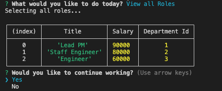
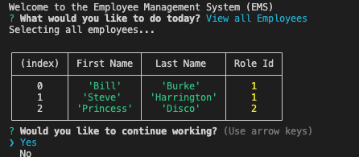
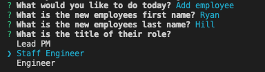
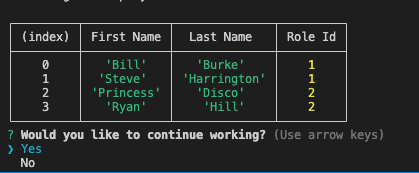

# Employee-Management-System

The purpose of this project was to create a MySQL Database that users are able to access and minpulate. The users will be able to view all employees, roles, and departments as well as adding each.

The application itself uses Javascript, node.js, inqurier, and MySQL.

Here are screenshots of the deployed EMS.

Assistance with the project was done with a trilogy tutor named Paul. I will need to ask his last name!

Link to the video of the employee management system here:
https://drive.google.com/file/d/1ygRgFIqCDC6f9acLM0RuNx9DAeJw7Elb/view?usp=sharing
